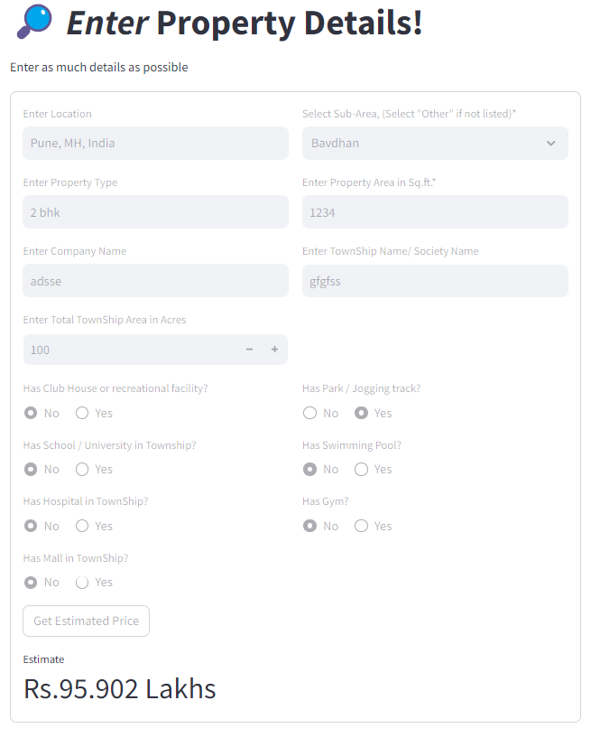
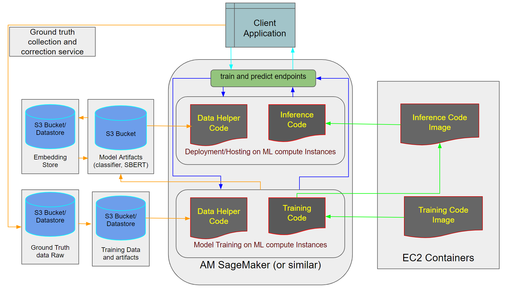

# Pune House Price Prediction 📶💸💸🏚️🏗️🏠💸💸📶

# Coding Exercise - Predictive modeling for price prediction for a given property in the Pune district with [Interactive app](https://punehousepriceprediction.streamlit.app/)

## Task

This app is focused on predicting house prices given a set of features. The task is divided into data cleaning, feature engineering, basic modeling and model deployment for CI/CD.

## Demo App Screenshots

Here are some demo screenshots for the app and you can also try it using [this link](https://punehousepriceprediction.streamlit.app/)<h6>(slow to load)</h6>

## Environment

This project is implemented using `Python 3.10`, `Scikit-Learn`. Here, 2 different deployment approaches using iteractive UI (Streamlit and FastAPI) are demonstrated.

## Approach

The basic approach is as follows (The details of each step are written in respective notebook):

1. Data Cleaning and EDA:

    - [`research/01_EDA.ipynb`](https://github.com/shriadke/PuneHousePricePrediction/blob/main/research/01_EDA.ipynb) details the EDA and initial data statistics.

    - The given data and columns are not consistent in naming, data-type and not complete with respect to the data values.

    - The price in million can be considered as target variable and thus the task becomes a classical regression problem.

    - The price output of our models, can be interpreted with the error range while displaying it to the customers.

2. Feature Engineering:

    - [`research/02_feature_eng.ipynb`](https://github.com/shriadke/PuneHousePricePrediction/blob/main/research/02_feature_eng.ipynb) details the complete feature engineering, the reasoning behind features and feature selection process.

    - Column "Description" was not considered for this study.

    - There are 15 distinct features extracted from the given data, and __none of the original feature/columns are used as it is or with some cleaning__. Each of the 15 feature is derived from original columns using either of the following methods:
        * One-hot encoding for low-cardinality (Yes, No) type features
        * Ordinal/Label Encodings for ordered categorical features, eg. Property Type, Number of Bedrooms.
        * Target encodings for high cardinality categorical features
        * Datatype conversion and Standardization for numerical features such as area.
    
    - For demonstration purposes, all features are used for model training, however, in practice, a subset with highly corelated features should be selected.

3. Model Selection and Training:

    - [`research/03_model_research.ipynb`](https://github.com/shriadke/PuneHousePricePrediction/blob/main/research/03_model_research.ipynb) details the basic modeling research for Regression problem.

    - There are 2 major set of models one can leverage: Linear models, and Tree-based models.

    - The notebook shows implementation and training performance for 3 linear and 2 tree-based models.

    - Although, the given data is not sufficient to train a model with high performance (i.e. low error in price prediction), I've demonstrated tuning, model selection methodologies on a superficial level.

    - With the given data, and choice of encoding, most of the models gets overfitted pretty quickly. In the future, this can be improved with multiple techniques based on the model of choice.

4. Model Deployment:

    - [`research/04_sagemaker_deploy.ipynb`](https://github.com/shriadke/PuneHousePricePrediction/blob/main/research/04_sagemaker_deploy.ipynb) details the model deployment on SageMaker using local Jupyter Notebook, SM, and S3.

    - The basic steps involved:
        * Raw Data Ingestion,
        * Data Validation and Transformation
        * Data Storage and loading
        * SM Model scripting and training
        * SM Model deployment and endpoint creation  

    - All these steps can also be done locally with the given [app_fast_api.py](https://github.com/shriadke/PuneHousePricePrediction/blob/main/app_fast_api.py). This can also be deployed on AWS EC2 instance and CI/CD can be done with GitHub Actions. This project demonstrates it with sample code architecture and required files. (AWS instances are not running and may indicate job failure).

5. Prediction:

    - `predict()` is used to perform the price prediction in real-time. This can be ran locally, use SageMaker endpoint, or use StreamLit webApp directly.
    - More details on how to use and test locally are given in upcoming [Usage section](https://github.com/shriadke/PuneHousePricePrediction#usage).

#### ***_WARNING_*: For the data, model and other artifacts such as saved models, scalars,etc.--> some paths may be broken as I was not able to upload all data into github due to their size. Therefore, if running locally, make sure the filepaths and the corresponding variables are properly loaded/initialized.  

## Brief on EDA, Training and Evaluation 

- The given features needs a lot of cleaning before using it into production, thus there needs to be a separate pipeline with manual supervision to ensure data quality.

- Most high cardinality features such as Property developer, Name, description can be converted to vector embeddings for a more generalized feature extraction.

- Nonetheless, current models fits well on the given data with a low avg. RMSE of Rs. 2 Million. This can be used as the range of final prediction. For example, If Model Predicts the price as Rs 10 Mn, the display price can be in the range of Rs. 8 to 12 Mn . This can be significantly improved by addressing the data quality, data adequecy, and feature correctness.

- For deployment with Databricks, the above code architecture can be duplicated and should be followed with the required configurations specified in [config/config.yaml](https://github.com/shriadke/PuneHousePricePrediction/blob/main/config/config.yaml). 

## File Structure
The folder structure is taken from an open-source project repository and I've been using the same throughtout my professional career for various end-to-end projects. It follows standard best practices to software engineering and MLOps along with the pipeline that can be reused with various cloud platforms. The details for each folder is given at the end. Following are the generic files and sample description: 

1. [app.py](https://github.com/shriadke/PuneHousePricePrediction/blob/main/app.py)
	This is the main app file used to build the `streamlit` app implementation of PuneHousePricePrediction app that uses `predict()` method to obtain the price for a given set of house features.

2. [app_fast_api.py](https://github.com/shriadke/PuneHousePricePrediction/blob/main/app_fast_api.py)
	This is the another implementation of PuneHousePricePrediction API built with the `FastAPI` package. This contains 2 main APIs:
	- `/train`: To run the embedding training pipeline using UI provided by FastAPI.

3. [main.py](https://github.com/shriadke/PuneHousePricePrediction/blob/main/main.py)
	This is the Python module that encapsulates all the different methods performed in this pipeline. This module is further used by the API service in the above [app_fast_api.py](https://github.com/shriadke/PuneHousePricePrediction/blob/main/app_fast_api.py) to orchestrate different stages in deployment. 

4. [src/housePricePrediction](https://github.com/shriadke/PuneHousePricePrediction/blob/main/src/housePricePrediction/)
	This is the main project module with all the components, configs, pipelines and other supporting code. This will be generated as source package after [`setup.py`](https://github.com/shriadke/PuneHousePricePrediction/blob/main/setup.py) is executed.

5. [requirements.txt](https://github.com/shriadke/PuneHousePricePrediction/blob/main/requirements.txt)
	This file contains the necessary packages required for this project.

6. [Dockerfile](https://github.com/shriadke/PuneHousePricePrediction/blob/main/Dockerfile)
	This file contains build instructions for API deployment using Docker. This step is not functional at this point.

7. [data/](https://github.com/shriadke/PuneHousePricePrediction/blob/main/data/)
	This folder contains all raw and processed data along with embeddings.

8. [research/](https://github.com/shriadke/PuneHousePricePrediction/blob/main/research/)
	This folder contains all the research steps performed before incorporating the code into src.

### Training Pipeline workflow

The training pipeline is invoked using [`main.py`](https://github.com/shriadke/PuneHousePricePrediction/blob/main/main.py). There are 5 basic pipelines in the given order: `Data Ingestion --> Data Validation --> Data Transformation --> Model Trainer --> Model Evaluation` , and a separate Prediction pipeline is provided for `predict()` method. 

Steps to create a pipeline are listed in [docs/workflows.md](https://github.com/shriadke/PuneHousePricePrediction/blob/main/docs/workflows.md). Following are the main files involved in any given pipeline from `main.py`:

1. `<Name>Pipeline()` class: Invokes the corresponding pipeline configuration from [`configuration.py`](https://github.com/shriadke/PuneHousePricePrediction/blob/main/src/housePricePrediction/config/configuration.py) and required [`component`](https://github.com/shriadke/PuneHousePricePrediction/blob/main/src/housePricePrediction/components) methods.
2. [`configuration.py`](https://github.com/shriadke/PuneHousePricePrediction/blob/main/src/housePricePrediction/config/configuration.py) : File to define and load all the required configurations for different pipelines. This includes the [`entities`](https://github.com/shriadke/PuneHousePricePrediction/blob/main/src/housePricePrediction/entity/__init__.py) defined in [`config.yaml`](https://github.com/shriadke/PuneHousePricePrediction/blob/main/config/config.yaml).
3. [`components`](https://github.com/shriadke/PuneHousePricePrediction/blob/main/src/housePricePrediction/components/) : This is the main folder that contains corresponding pipeline's business logic and necessary callable method implementations.
4. [`utils/common.py`](https://github.com/shriadke/PuneHousePricePrediction/blob/main/src/housePricePrediction/utils/common.py) : Provides common methods implementation used across the project such as file download, cleaning, embedding loading, processing, etc.

This architecture can be modified as per the project's overall needs to follow standard software engineering practices.

Following figure shows the basic system that can be implemented for this:

## Usage

Apart from the demo above, if you wish to run the project locally, then follow the steps below:

- Clone this repo using `git clone  https://github.com/shriadke/PuneHousePricePrediction`.

- As described in [File Structure](https://github.com/shriadke/PuneHousePricePrediction#file-structure), you can verify the files.

- Create an environment using  `conda create -n pricepred python=3.10`

- Activate the above environment `conda activate pricepred`

- Install all packages `pip install -r requirements.txt`

- To view the streamlit app, run `streamlit run app.py`

- To use FastAPI interface, run `python app_fast_api.py`

The Price Prediction App will be deployed on your chosen platform. 

### *Have some fun with it, because I did :wink: !!*

## Future Work

In future, given more-time and additional data, one can build a stable app that does the task as above with highest accuracy and great details. Following are some areas of improvements in my approach:

1. Better Embeddings

	- For features with text data, Vector embeddings with similarity metrics will prove better as a better approach.
    - This will increase the computational and storage resource requirements but will improve the model performance.
	
2. Improved Data Cleaning
	- Currently the data isn't large enough and we don't have enough generalized samples for each feature.
	- Most of the data was manually curated and cleaned on case-by-case basis.
    - In production, the pipeline should consider data augmentation and imputation techniques to reduce manual efforts. 
	
3. Improved Regression Model

	- The current model is a basic regressor with overfitted parameters. This can be improved with regularization, pruning, ensemble, etc.
    - The feature set can be reduced and more features can be crafted with careful combination of the available data.

4. Enhanced pipeline:
    
    - The current repo shows a basic demo of training pipeline within the local environment. This can be scaled up to utilize cloud infrastructure and leverage those to curate/generate the data, train large models, and monitor the performance efficiently.
    - The prediction pipeline as demonstrated can be deployed on open-source servers/platforms. These can be protected with services such as AWS to ship and deploy in a more sophisticated way.
    - Custom ground-truth generation and monitoring pipeline can be implemented in a similar way to improve the model in the live state by using the user feedback as a training data which then will trigger a training pipeline (with some triggering interval) to adjust the new/misclassified input in the current model.

With all the above improvements/ additional work, this same pipeline can be used to productionize a fully-functioning House Price Prediction App/platform!!

## Thanks for Visiting!!
	
